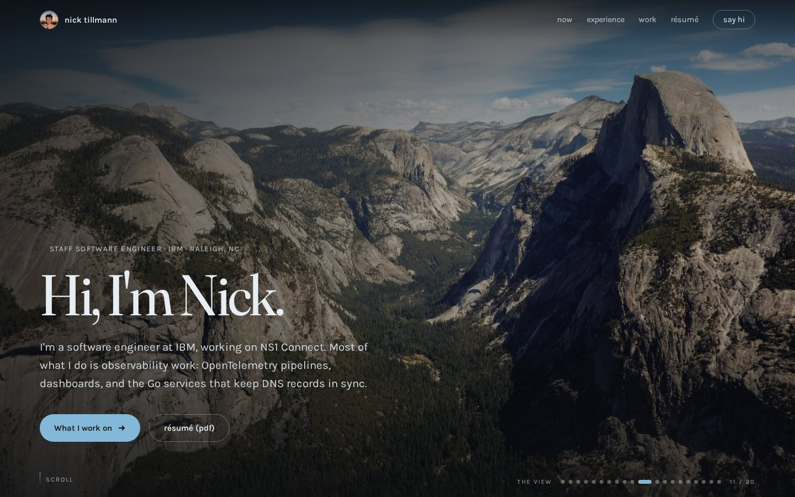
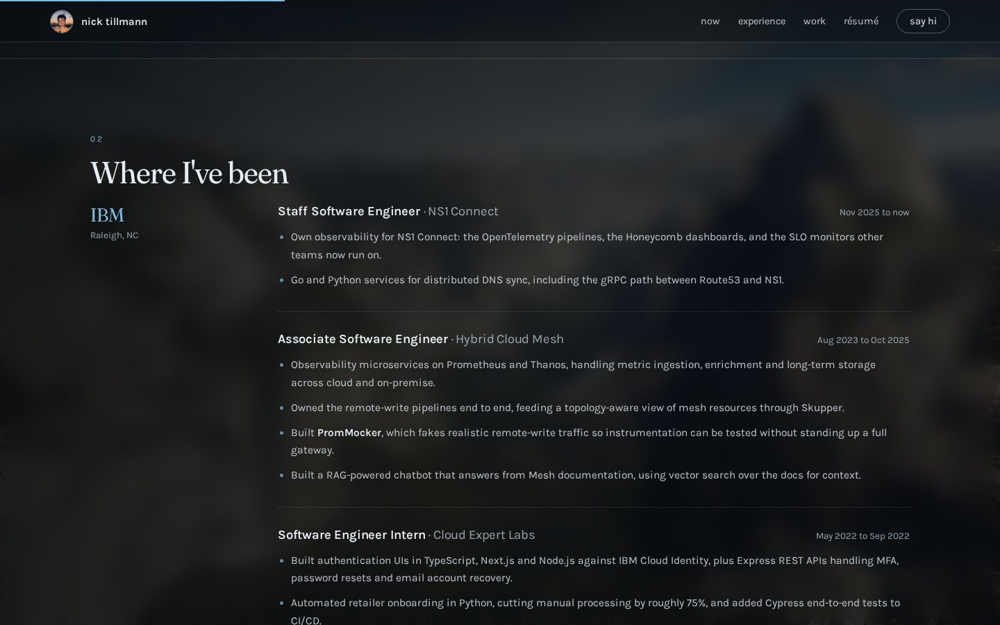
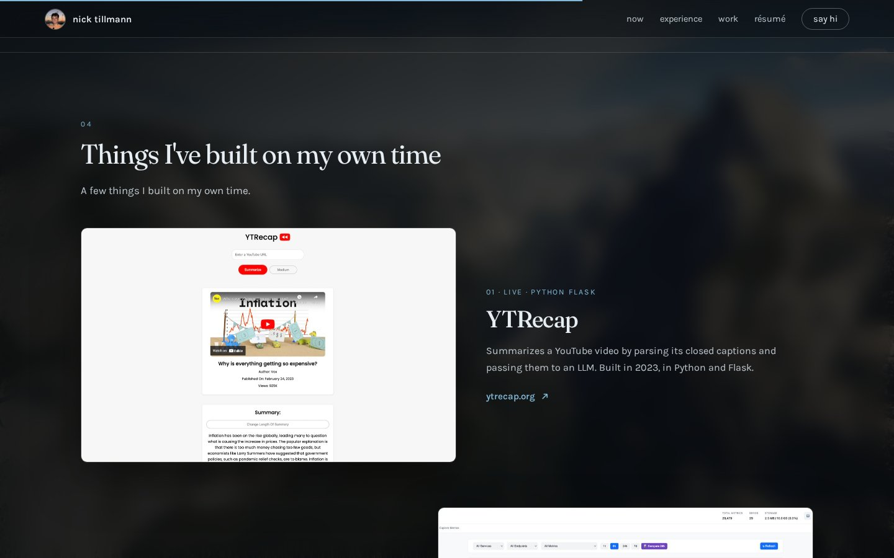
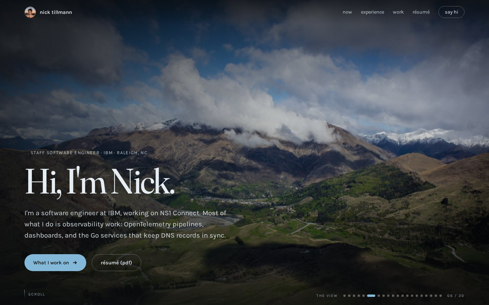
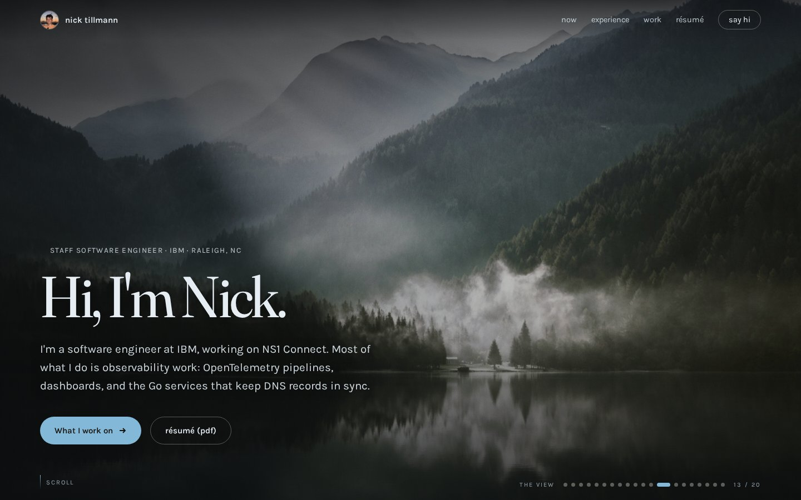
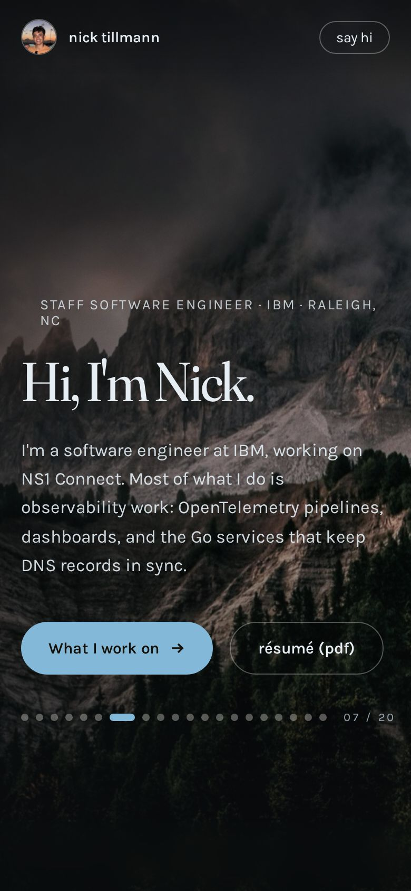

## [nicktill.com](https://nicktill.com/)


### Landing Page


### Experience


### Projects Section


## Changeable Scenery




### Mobile Friendly


### Technologies Used

Plain HTML, CSS and JavaScript, with no framework or build step. The site lives in `redesign/`.<br/>
Fonts are Fraunces, Karla and IBM Plex Mono from Google Fonts.<br/>

### Running Locally

```sh
python3 serve-redesign.py   # serves redesign/ at http://127.0.0.1:3000
npm run deploy              # publishes redesign/ to GitHub Pages
```
